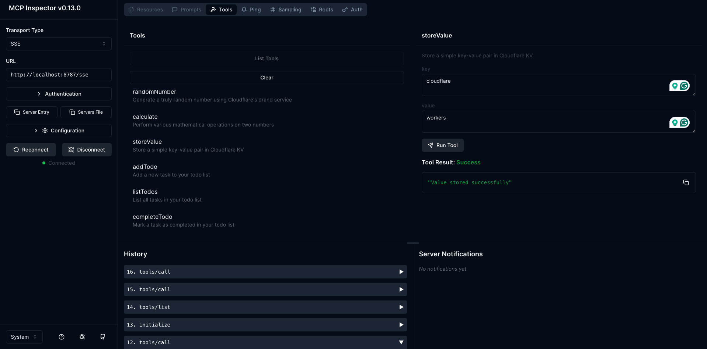

# Cloudflare MCP

This repository contains the code to create an MCP server and deploy it on Cloudflare workers

## Pre-requisites

Before starting this workshop, please ensure you have the following installed:

- Node.js (version 18 or later) - Download
- Wrangler CLI - Install with `npm install -g wrangler`
- A Cloudflare account for deployments

## Getting started

1. Create a new MCP Server using the Cloudflare template

   ```bash
   npm create cloudflare@latest -- my-mcp-server --template=cloudflare/ai/demos/remote-mcp-authless
   ```

2. Navigate to the project directory

   ```bash
   cd my-mcp-server
   ```

3. Run this MCP Server locally
   You can start your MCP Server by running the following command:

   ```bash
   npm start
   ```

## Testing

Test your MCP Server using MCP inspector
To test your MCP Server, you can use the MCP inspector:

```bash
npx @modelcontextprotocol/inspector
```

You will see the inspector with all the tools as seen below



You can also use [cloudflare playground](https://playground.ai.cloudflare.com/) which is a platform provided by cloudflare to connect 
an MCP server

## Deploying

You can deploy this server to cloudflare workers with a single command, the first time you might 
be needed to establish a connection to workers via wrangler but it is straight forward

```bash
   npm run deploy
```

This will deploy your MCP server to a Cloudflare Workers URL like:
`https://my-mcp-server.<your-account>.workers.dev/sse`

## Credits

Thanks to [Ricky Robinett](https://github.com/rickyrobinett) from Cloudflare for connecting these amazing technolgies to showcase, how easy it is to deploy our own
